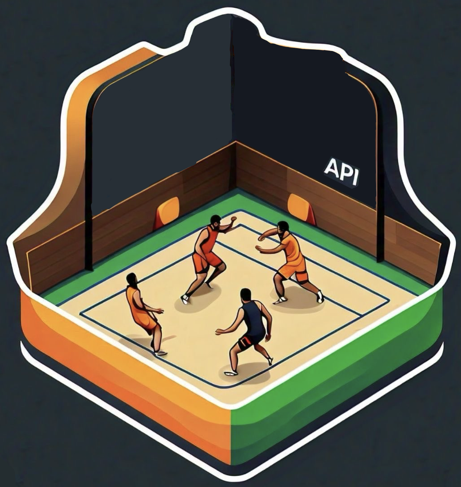

<p align="center">
  
</p>

<h1 align="center">Kabaddi Data API</h1>

<p align="center">
  <strong>Comprehensive data collection and analysis tools for professional Kabaddi leagues</strong>
</p>

<p align="center">
  <a href="#features">Features</a> •
  <a href="#installation">Installation</a> •
  <a href="#usage">Usage</a> •
  <a href="#contributing">Contributing</a> •
  <a href="#license">License</a>
</p>

---

Kabaddi Data Aggregator is a Python module that provides tools for collecting and analyzing data from professional Kabaddi leagues. It uses web scraping techniques to gather information about teams, players, and match statistics from various online sources.

## Features

- Retrieve team names and URLs
- Fetch player information and statistics
- Get current season standings
- Extract team line-up data
- Analyze team-level statistics
- Gather player performance data


## Installation 

Please install the Kabaddi Data API using pip:


```shell
pip install pro_kabaddi_data
```

Deployed here: https://pypi.org/project/pro-kabaddi-data/

## Requirements

- Python 3.7+
- Selenium WebDriver
- Firefox browser (for Selenium WebDriver)

## Usage

Here's a quick minimal example of how to get started to use the Kabaddi Data Aggregator:

```python
from prokabaddidata import prokabaddidata


# Initialize the aggregator
aggregator = prokabaddidata.KabaddiDataAggregator()

# Get all team names
team_names = aggregator.get_all_team_names()
print("Team Names:", team_names)

# Get current season standings
standings = aggregator.team_season_standings()
print("Season Standings:", standings)

# Get player information
players_info = aggregator.get_players_team_info_and_profile_url()
print("Players Info:", players_info[:5])  # Print first 5 players

```

For more detailed usage instructions and API documentation, please refer to our [documentation page](https://annimukherjee.github.io/ProKabaddi_API/).

## Contributing

We welcome contributions to the Kabaddi Data Aggregator project! If you'd like to contribute, please follow these steps:

1. Fork the repository
2. Create a new branch (`git checkout -b feature/your-feature-name`)
3. Make your changes
4. Commit your changes (`git commit -am 'Add some feature'`)
5. Push to the branch (`git push origin feature/your-feature-name`)
6. Create a new Pull Request


## License

This project is licensed under the MIT License - see the [LICENSE](LICENSE) file for details.

## Acknowledgments

- Thanks to the various website owners for providing the data sources

## Contact

If you have any questions, feel free to reach out to [Aniruddha Mukherjee] at [mukh.aniruddha@gmail.com] or open an issue in the GitHub repository.

---

<p align="center">
  Made with ❤️ for Kabaddi enthusiasts and data analysts
</p>

Please star this repository if you found it helpful! Your support is greatly appreciated.
