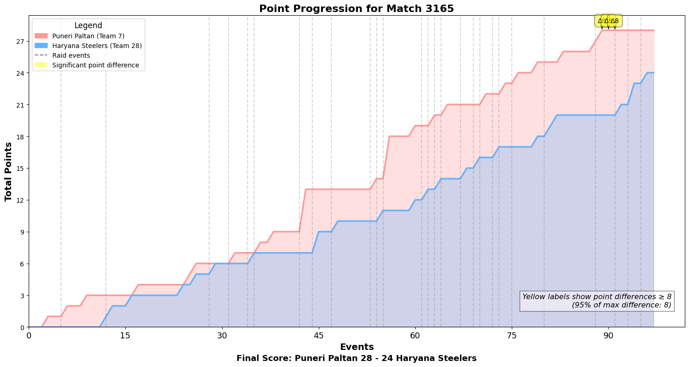

## `plot_point_progression(season, match_id)`

Plot the point progression for both teams throughout a specific match in a given season.

### Parameters:
- `season` (int): The season number for the match.
- `match_id` (int): The unique identifier for the match.

### Example Usage:
```python
pkl.plot_point_progression(season=10, match_id=3165)
```

Notes:
- This function visualizes how the total points for each team progressed over the course of the match.
- It highlights important raid events and significant point differences between teams.
- The final score and team names are annotated for easy reference