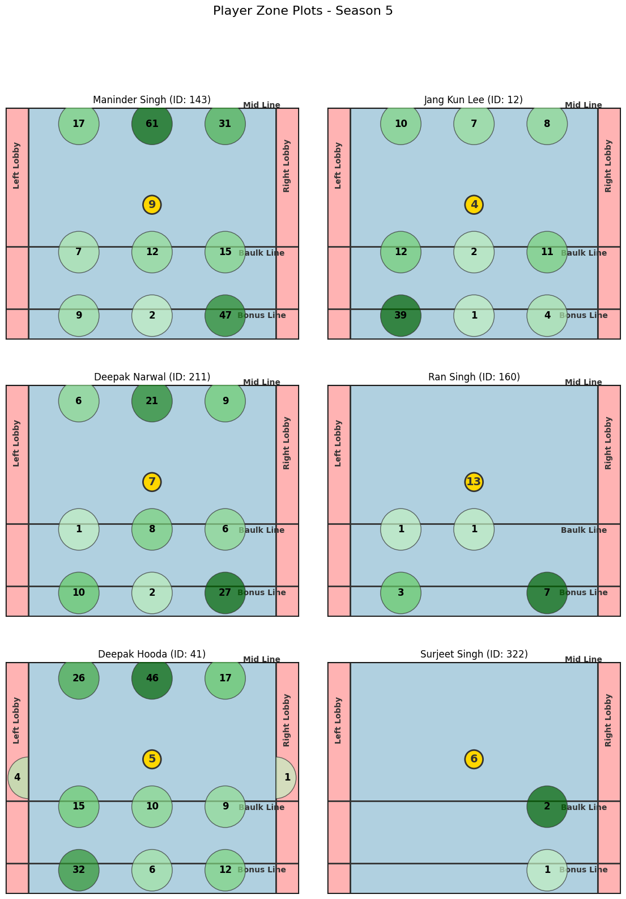

## `plot_player_zones_grid(player_ids, season, zone_type='strong', max_cols=4)`

Plot a grid of player zone heatmaps for multiple players in a specific season.

### Parameters:
- `player_ids` (list of int): List of player IDs for which the zones will be plotted.
- `season` (int): The season number for which the data will be retrieved.
- `zone_type` (str): Type of zones to plot, either `'strong'` or `'weak'`.
- `max_cols` (int, optional): Maximum number of columns for the grid layout. Defaults to 4.

### Example Usage:
```python
pkl.plot_player_zones_grid([143, 12, 211, 160,41,322], season=5, zone_type='strong', max_cols=2)```
```


Notes:
- This function generates a grid of player zone heatmaps, allowing for side-by-side comparisons of multiple players.
- Invalid player IDs or missing data will be skipped, and only valid plots will be displayed.
- The grid size adjusts based on the number of players and the max_cols setting.